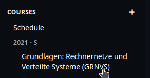

# Administration Guide for Lecturers

## Get Your TUM-Live Admin account

In order to manage your own lectures using TUM-Live you need an account with 
administrative access. Please get in touch with us at [live@rbg.tum.de](mailto:live@rbg.tum.de?subject=Requesting%20an%20Admin%20Account) to get one.
You'll then receive an email with instructions to set a password.
This account can be shared with **all** users who need to edit the course, therefore
we currently recommend requesting a new user on a per-course basis.

After you obtain the administrator account and set the password,
you can choose "use an internal account" on the login page, and then enter the username and password to log in.

## Create a course
Once you are logged in with your admin account, you can navigate to the Admin Panel.

On the left-hand side there is a button to create a new course:

Alternatively, you can [duplicate an existing course](...) of yours, typically from a previous semester.

## Manage lectures

Under one course, multiple lectures can be created.
Depending on the type and settings, each lecture can either be
[live-streamed at the scheduled time and available for playback later](...),
[only live-streamed at the scheduled time without playback availability](...),
or [have uploaded videos available for viewing without a live broadcast](...).

Regarding live-streaming, you can choose to stream from [the supported lecture halls](...) or opt for [self-streaming](...).

You will now be able to navigate to your course:

If your TUMonline ID was set, your lectures have been loaded automatically. Otherwise, you can always add lectures on the button of the page.
Please add a descriptive Title for your lectures. This is optional but helps your students a lot.
You can also add a description to each stream. You may use markdown to include links (e.g. to tweedback):

### Course Parameters

This will open a new page where you can set a few parameters of the course:

- 1: **TUMOnlineID**: This is optional but very useful. If set you can click the "Load Infos From TUMOnline" button which will fill out some fields like the semester and course name. Additionally cou will be able to:
    - Automatically load the timeslots of the course from TUMOnline
    - Make the course available only for users that are enrolled in TUMOnline
    - Show this course more prominently (under "your courses") on the start page to them.
- 2: **Title**: The tile of your course as shown to users.
- 3: **Teaching Term**: When does this course take place? Make sure to format this accordingly (e.g. `Sommersemester 2021` or `Wintersemester 2021/22`)
- 4: **Slug**: This is the identifier for your course. It will show up in the courses URL, should be short and **must** be unique per semester. Example: `Einführung in die Informatik` -> `eidi`
- 5: **Visibility**: Who should be able to see this course? This can be changed later.
  - **Public**: Everyone can view the courses videos, regardless of whether they are enrolled or logged in.
  - **Enrolled**: Users who are either enrolled to your course in TUMonline or specifically invited by you.
  - **Logged in**: Everyone with a LRZ id (like `ab12cde`) can log in and see your course
- 6: **Settings**: Some settings for your course. These can be changed later.
  - **Enable VoD**: All streamed lectures will be made public after the stream if this is enabled.
  - **Enable Downloads**: Students will be able to download the lectures. This is highly recommended as it allows students with bad internet connection to participate in the lectures.
  - **Enable Live Chat**: The viewers of this course are able to comment on streams using the live chat. Regardless of the visibility, chat users need to be logged in. You can block people from using the chat if they misbehave.
