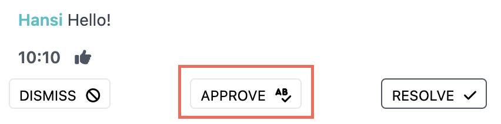
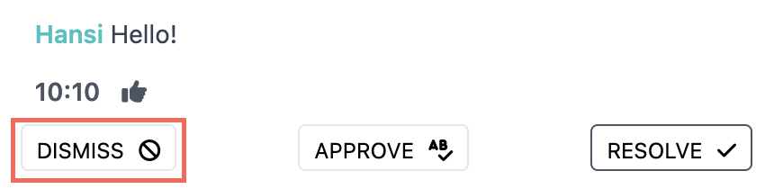
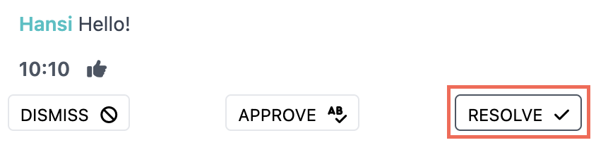
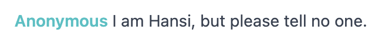
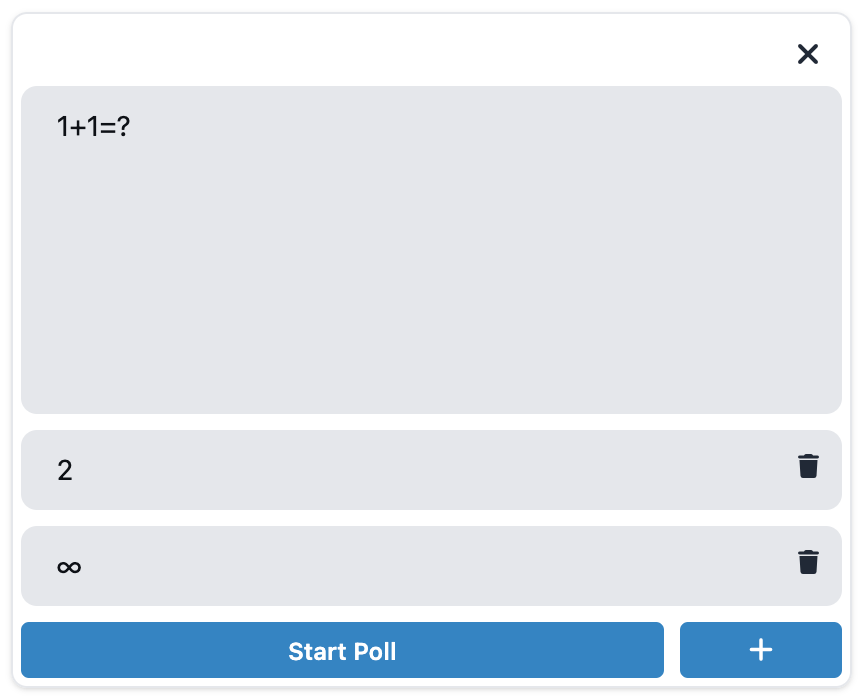
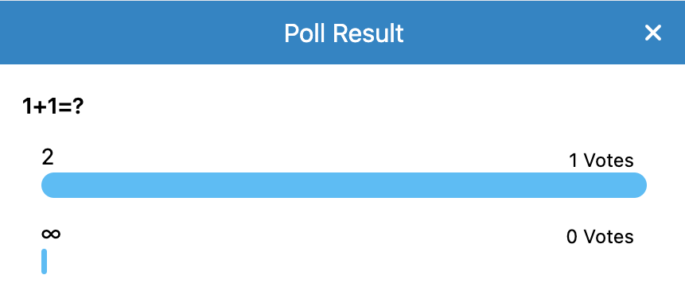
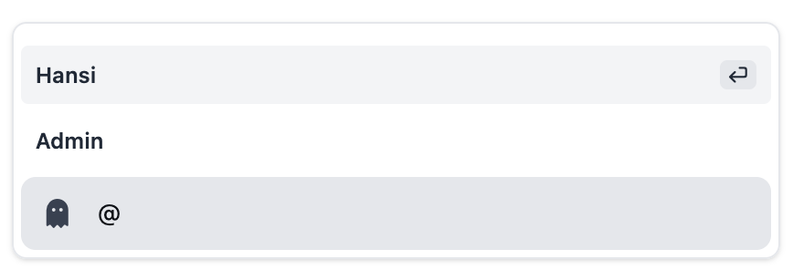

# Chat

## Active Chat

On the Admin page's sidebar navigate to: 

`Courses > 'Term' > 'Your Course' - Settings` 

There you will find a few checkboxes to (de-)activate the chat 
and enable certain features.

## Moderate Chat

### Approve Messages

If `Moderate Chat` is enabled, chat messages have to be approved by an admin of the course before being visible for all.

### Remove messages

If necessary, a message can also be removed. 

### Resolve messages

If a message contains a question and this question has been answered, the message can be marked as 'resolved'.

After that a message is visibly depicted as such: 

### Anonymous Chat

If `Anonymous Messages` is enabled, users may hide their identity. 
This means all of their messages will be sent by the user _'Anonymous'_.

## Interact with Chat 

### Chat Polls 

With a click on the `Create Poll`-Button a poll can be created! The form 
is very intuitive. 

To add another answer-option, press ``+``. 

If closed, the result will be nicely depicted with a graph at the top of the chat: 

At the time of writing this document (March 2022) polls are **single choice**. 

### @ users 

By inserting a `@` in the chat input a list of 
non-Anonymous users will be displayed. A user can be addressed
by clicking the username or selecting the user in the list. 
The list can be navigated with the UP and DOWN arrows.

