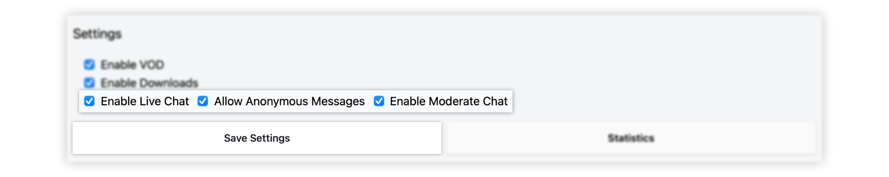
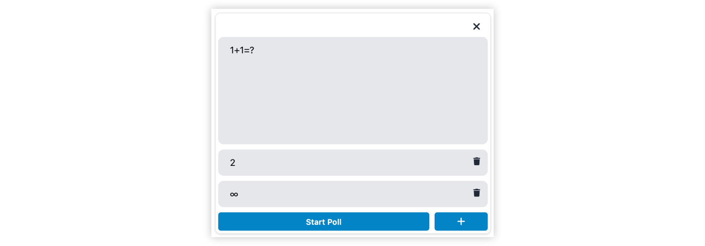

# Live Chat

## Enable Live Chat

On the Admin page's sidebar navigate to: 

`Courses > 'Term' > 'Your Course' - Settings` 

There you will find a few checkboxes to enable/disable the chat 
and a variety of different chat-related features.

## Moderate Chat

### Approve Messages

Set `Enable Moderate Chat`, and new chat messages need approval by a course admin before being visible.

### Remove messages

If necessary, a click on `Dismiss` removes a message.

### Resolve messages

Messages can be marked as 'resolved'.
That can be especially useful when messages contain already answered questions.

After that, a message is visibly depicted as such: 

### Anonymous Chat

Set `Allow Anonymous Messages`, and users may hide their identity by 
sending their messages as the user _'Anonymous'_.

## Interact with Chat 

### Chat Polls 

A click on `Create Poll` at the bottom of the chat opens a dialog. The form 
is very intuitive. For additional answers, press ``+`` to add another option.

A click on ``Publish and Close`` makes the results visible to every user.
If closed, a graph at the top of the chat depicts the result nicely.

At the time of writing this document (April 2022), polls are **single choice**. 

### Address users 

Insert an `@`-Symbol in the chat-input, and a list of non-Anonymous users will be displayed. A click or ENTER appends the chosen user to the addresses. Alternatively, navigation via
UP and DOWN keys is also possible. 

### Emojis 

Insert a ``:`` and a single letter in the chat-input, and a list of emojis will be disabled. One may use the arrow keys to navigate it. 

