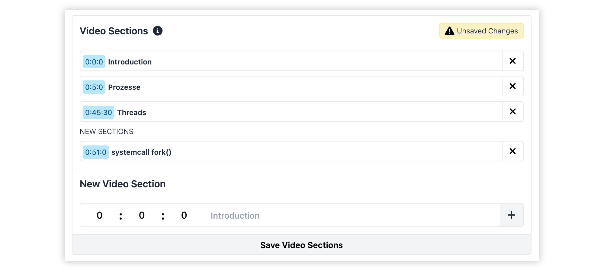

# Video 

# VOD Sections 

Structuring lectures into sections makes lectures more rewatchable. 
A click on a section will jump to the given timestamp. Hence, students can repeat
lectures section-wise. 

## Create Sections 

On the Admin page's sidebar navigate to:

`Courses > 'Term' > 'Your Course' - Settings` 

There you will find a list of lectures. Sections can only be added 
to VOD streams. (Visualized by the Green VOD Symbol) 

The UI for managing video sections is very intuitive.

