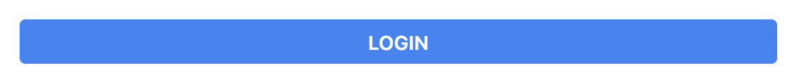
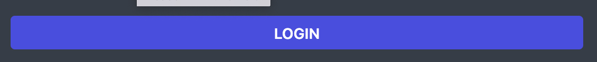
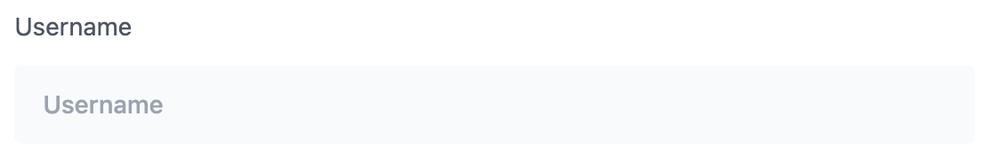
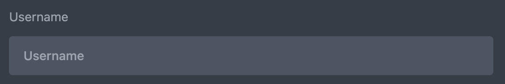

# Components

## Buttons

### Primary



```html
<button type=""
        class="block bg-blue-500 text-center px-3 py-1 mt-3 rounded w-full dark:bg-indigo-600">
    <span class="text-white uppercase text-sm font-semibold">Login</span>
</button>
```

### Secondary


```html
<!-- change background on :hover -->
<button @click=""
        title=""
        class="rounded-lg px-3 py-2 w-fit bg-gray-100 hover:bg-gray-200 dark:bg-secondary-light dark:hover:bg-gray-600">
    <i class="fa-solid fa-comments text-4"></i>
</button>

<!-- change text-color on :hover -->
<button @click=""
        title=""
        class="rounded-lg px-3 py-2 w-fit bg-gray-100 dark:bg-secondary-light hover:text-1">
    <i class="fa-solid fa-comments text-4"></i>
</button>
```

## Inputs




```html
<div class="text-sm">
   <label for="" class="block text-5">Password</label>
   <input type="" name="" id="" placeholder="" autofocus="" required
          class="rounded px-4 py-3 mt-3 focus:outline-none border-0 bg-gray-50 w-full dark:bg-gray-600"/>
</div>
```

